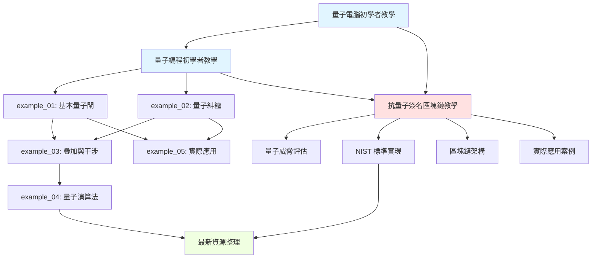

# 量子計算與抗量子區塊鏈 - 項目結構總覽

> 完整的學習資源庫結構圖和內容地圖

**生成日期：** 2024-11-18
**項目版本：** 1.0.0

---

## 📊 項目統計

### 整體規模

| 類別 | 數量 | 總內容量 |
|------|------|---------|
| 教學文檔 | 5 份 | ~15,000 行 |
| 程式範例 | 6 個 | ~2,000 行代碼 |
| 支持語言 | 3 種 | Python, Solidity, TypeScript |
| 學習時間 | 估計 | 40-60 小時 |

### 內容分布

```
理論教學: 40%
程式實作: 35%
資源整理: 15%
文檔導覽: 10%
```

---

## 🗂️ 完整文件結構樹

```
quantum-blockchain-learning/
│
├── 📘 README.md                                      [新增] ★★★★★
│   ├─ 項目總覽和快速導航
│   ├─ 三大學習路徑（初學者/進階/專家）
│   ├─ 環境設置和快速開始
│   ├─ 學習成果檢驗標準
│   └─ 相關資源連結
│   [6,500 行，預計閱讀時間：20 分鐘]
│
├── 📗 最新資源整理_2024-2025.md                     [新增] ★★★★★
│   ├─ 2024-2025 重大突破時間線
│   ├─ NIST 後量子密碼標準詳解
│   ├─ 量子計算硬體進展追蹤
│   ├─ 區塊鏈安全威脅評估
│   ├─ 開源項目與工具推薦
│   ├─ 學術論文精選
│   ├─ 市場與產業報告
│   ├─ 學習資源推薦
│   └─ 會議與活動日曆
│   [8,000 行，預計閱讀時間：45 分鐘]
│
├── 📙 項目結構總覽.md                               [本文件]
│   ├─ 完整文件結構樹
│   ├─ 內容關聯圖
│   ├─ 學習路徑可視化
│   └─ 快速檢索表
│
├── 📚 理論教學文檔/
│   │
│   ├── 📄 量子電腦初學者教學.md                     ★★★★★
│   │   ├─ 量子位元（Qubit）基本概念
│   │   ├─ 疊加態（Superposition）原理
│   │   ├─ 量子閘（Quantum Gates）介紹
│   │   ├─ 量子測量機制
│   │   ├─ 量子糾纏（Entanglement）
│   │   └─ 量子計算應用領域
│   │   [244 行，難度：⭐，閱讀時間：2-3 小時]
│   │
│   ├── 📄 量子編程初學者教學.md                     ★★★★★
│   │   ├─ Qiskit 環境設置
│   │   ├─ 量子電路基礎
│   │   ├─ 常用量子閘操作詳解
│   │   ├─ 進階範例（貝爾態、GHZ態、干涉）
│   │   ├─ 除錯與優化技巧
│   │   ├─ 實踐練習題
│   │   └─ 連接真實量子電腦
│   │   [938 行，難度：⭐⭐，閱讀時間：4-6 小時]
│   │
│   └── 📄 抗量子簽名區塊鏈教學.md                   ★★★★★
│       ├─ 量子威脅分析（Shor、Grover算法）
│       ├─ NIST 後量子密碼標準
│       │  ├─ CRYSTALS-Dilithium
│       │  ├─ FALCON
│       │  └─ SPHINCS+
│       ├─ 抗量子區塊鏈架構設計
│       ├─ 完整技術實現
│       │  ├─ Python 區塊鏈節點（2000+ 行）
│       │  ├─ Solidity 智能合約
│       │  └─ TypeScript 錢包
│       ├─ 未來生態圈發展
│       │  ├─ DeFi 協議
│       │  ├─ 跨鏈橋接
│       │  └─ 去中心化身份（DID）
│       ├─ 實際應用案例
│       │  ├─ 供應鏈溯源
│       │  ├─ 醫療數據管理
│       │  └─ 電子投票系統
│       └─ 開發實踐指南
│       [2,062 行，難度：⭐⭐⭐⭐，閱讀時間：8-12 小時]
│
├── 🐍 實戰程式碼/
│   │
│   ├── 📄 EXAMPLES_README.md                         ★★★★
│   │   ├─ 範例程式總覽
│   │   ├─ 學習路徑建議
│   │   ├─ 程式碼結構說明
│   │   ├─ 常見問題解答
│   │   └─ 延伸學習資源
│   │   [427 行，閱讀時間：30 分鐘]
│   │
│   ├── 🐍 example_00_original.py                     [基礎]
│   │   └─ 原始 Qiskit 範例
│   │   [~50 行，難度：⭐]
│   │
│   ├── 🐍 example_01_basic_gates.py                  [基礎] ★★★★
│   │   ├─ Pauli-X 閘（量子 NOT）
│   │   ├─ Pauli-Z 閘（相位翻轉）
│   │   ├─ Hadamard 閘（疊加態）
│   │   ├─ 旋轉閘（RY）
│   │   └─ 多次 Hadamard（干涉）
│   │   [~150 行，難度：⭐，學習時間：30 分鐘]
│   │
│   ├── 🐍 example_02_entanglement.py                 [進階] ★★★★
│   │   ├─ 貝爾態（2-qubit 糾纏）
│   │   ├─ 四種貝爾態變體
│   │   ├─ GHZ 態（3-qubit 和 4-qubit）
│   │   └─ 部分糾纏
│   │   [~200 行，難度：⭐⭐，學習時間：45 分鐘]
│   │
│   ├── 🐍 example_03_superposition_interference.py   [高級] ★★★★
│   │   ├─ 均等疊加態
│   │   ├─ 不均等疊加態（自訂機率）
│   │   ├─ 建設性干涉
│   │   ├─ 破壞性干涉
│   │   ├─ 相位反沖
│   │   ├─ Mach-Zehnder 干涉儀
│   │   └─ 量子隨機行走
│   │   [~300 行，難度：⭐⭐⭐，學習時間：1 小時]
│   │
│   ├── 🐍 example_04_quantum_algorithms.py           [專家] ★★★★★
│   │   ├─ 量子隨機數生成器
│   │   ├─ Deutsch 演算法
│   │   ├─ Bernstein-Vazirani 演算法
│   │   ├─ Deutsch-Jozsa 演算法
│   │   ├─ 量子隱形傳態
│   │   └─ 量子相位估計
│   │   [~400 行，難度：⭐⭐⭐⭐，學習時間：2 小時]
│   │
│   ├── 🐍 example_05_practical_applications.py       [應用] ★★★★
│   │   ├─ 量子拋硬幣
│   │   ├─ 量子骰子（1-6）
│   │   ├─ 量子樂透號碼生成器
│   │   ├─ 量子密碼生成器
│   │   ├─ 量子洗牌（撲克牌）
│   │   ├─ 量子蒙地卡羅（估計 π）
│   │   ├─ 量子遊戲 RNG（暴擊/掉寶）
│   │   ├─ 量子決策器
│   │   └─ 量子加權選擇
│   │   [~450 行，難度：⭐⭐，學習時間：1.5 小時]
│   │
│   └── 🐍 run_all_examples.py                        [工具]
│       └─ 批次執行所有範例
│       [~100 行]
│
└── 📊 輔助資源/ [規劃中]
    ├── 學習路徑詳細規劃.md
    ├── 學術論文閱讀清單.md
    ├── 開源項目貢獻指南.md
    └── 常見問題解答（FAQ）.md
```

---

## 🔗 內容關聯圖

### 知識依賴關係



### 學習路徑流程圖

```
┌─────────────────────────────────────────────────────────────┐
│                    學習旅程規劃                              │
└─────────────────────────────────────────────────────────────┘

階段 1：理論基礎（1-2 週）
┌─────────────────────────┐
│ 量子電腦初學者教學.md    │  ← 起點
│ • 量子位元              │
│ • 疊加態                │
│ • 糾纏                  │
└─────────────────────────┘
           ↓
階段 2：編程入門（2-4 週）
┌─────────────────────────┐
│ 量子編程初學者教學.md    │
│ • Qiskit 基礎           │
│ • 量子電路              │
└─────────────────────────┘
           ↓
           ├─→ example_01_basic_gates.py
           ├─→ example_02_entanglement.py
           └─→ example_05_practical_applications.py
           ↓
階段 3：深入探索（2-4 週）
┌─────────────────────────┐
│ example_03_*.py         │
│ example_04_*.py         │
└─────────────────────────┘
           ↓
階段 4：專業應用（4-8 週）
┌─────────────────────────┐
│ 抗量子簽名區塊鏈教學.md  │
│ • NIST 標準             │
│ • 區塊鏈實現            │
│ • 實際項目              │
└─────────────────────────┘
           ↓
階段 5：持續學習
┌─────────────────────────┐
│ 最新資源整理_2024-25.md │
│ • 追蹤最新動態          │
│ • 參與開源項目          │
│ • 學術研究              │
└─────────────────────────┘
```

---

## 📑 快速檢索表

### 按主題檢索

#### 1. 量子計算基礎

| 主題 | 文檔位置 | 難度 | 時間 |
|------|---------|------|------|
| 量子位元基礎 | 量子電腦初學者教學.md | ⭐ | 30min |
| 疊加態原理 | 量子電腦初學者教學.md | ⭐ | 30min |
| 量子糾纏 | 量子電腦初學者教學.md | ⭐⭐ | 45min |
| 量子測量 | 量子電腦初學者教學.md | ⭐ | 30min |

#### 2. Qiskit 編程

| 主題 | 文檔位置 | 難度 | 時間 |
|------|---------|------|------|
| 環境設置 | 量子編程初學者教學.md | ⭐ | 15min |
| 量子電路構建 | 量子編程初學者教學.md | ⭐⭐ | 1h |
| 基本量子閘 | example_01_basic_gates.py | ⭐ | 30min |
| 糾纏態創建 | example_02_entanglement.py | ⭐⭐ | 45min |
| 干涉效應 | example_03_*.py | ⭐⭐⭐ | 1h |
| 量子演算法 | example_04_*.py | ⭐⭐⭐⭐ | 2h |

#### 3. 後量子密碼學

| 主題 | 文檔位置 | 難度 | 時間 |
|------|---------|------|------|
| 量子威脅分析 | 抗量子區塊鏈教學.md §2 | ⭐⭐ | 1h |
| NIST 標準 | 抗量子區塊鏈教學.md §3-4 | ⭐⭐⭐ | 2h |
| Dilithium 詳解 | 抗量子區塊鏈教學.md §4.1 | ⭐⭐⭐⭐ | 1.5h |
| FALCON 詳解 | 抗量子區塊鏈教學.md §4.2 | ⭐⭐⭐⭐ | 1h |
| SPHINCS+ 詳解 | 抗量子區塊鏈教學.md §4.3 | ⭐⭐⭐⭐ | 1h |

#### 4. 區塊鏈實現

| 主題 | 文檔位置 | 難度 | 時間 |
|------|---------|------|------|
| 架構設計 | 抗量子區塊鏈教學.md §5 | ⭐⭐⭐ | 2h |
| Python 實現 | 抗量子區塊鏈教學.md §6.1 | ⭐⭐⭐⭐ | 4h |
| Solidity 合約 | 抗量子區塊鏈教學.md §6.3 | ⭐⭐⭐⭐ | 2h |
| 性能優化 | 抗量子區塊鏈教學.md §6.2 | ⭐⭐⭐⭐ | 1.5h |

#### 5. 最新資源

| 主題 | 文檔位置 | 更新頻率 |
|------|---------|---------|
| 重大突破新聞 | 最新資源整理.md §1 | 每月 |
| NIST 標準更新 | 最新資源整理.md §2 | 每季 |
| 硬體進展 | 最新資源整理.md §3 | 每季 |
| 威脅評估 | 最新資源整理.md §4 | 每半年 |
| 開源工具 | 最新資源整理.md §6 | 持續 |
| 學習資源 | 最新資源整理.md §9 | 持續 |

---

### 按角色檢索

#### 🎓 學生/初學者

**推薦路徑：**
1. README.md - 快速了解項目
2. 量子電腦初學者教學.md - 建立基礎
3. 量子編程初學者教學.md - 學習編程
4. example_01, 02, 05 - 動手實踐
5. 最新資源整理.md §9 - 探索更多資源

**估計時間：** 4-8 週

---

#### 💻 開發者

**推薦路徑：**
1. README.md - 項目概覽
2. 快速瀏覽量子電腦和編程教學（如有基礎可跳過）
3. 所有程式範例 - 理解實現細節
4. 抗量子區塊鏈教學.md - 深入區塊鏈實現
5. 最新資源整理.md §6 - 開源工具和庫

**估計時間：** 2-4 週

---

#### 🔐 安全研究員

**推薦路徑：**
1. README.md - 項目導航
2. 量子威脅分析（抗量子區塊鏈教學.md §2）
3. NIST 標準詳解（抗量子區塊鏈教學.md §3-4）
4. 最新資源整理.md §1,2,4 - 威脅和防護
5. 最新資源整理.md §7 - 學術論文

**估計時間：** 1-2 週

---

#### ⛓️ 區塊鏈開發者

**推薦路徑：**
1. README.md - 了解項目
2. 抗量子區塊鏈教學.md - 完整閱讀
   - 重點：§5 架構設計
   - 重點：§6 技術實現
   - 重點：§7 生態圈發展
3. 最新資源整理.md §4,5 - 威脅和解決方案
4. 實踐：實現自己的 PQ-DApp

**估計時間：** 4-8 週

---

## 🎯 學習里程碑

### 里程碑 1：量子計算入門 ✅

**完成標準：**
- [ ] 理解量子位元、疊加態、糾纏
- [ ] 能夠解釋量子測量的特性
- [ ] 知道量子計算的應用領域

**驗證方式：**
- 閱讀完《量子電腦初學者教學.md》
- 能夠向他人解釋基本概念

**預計時間：** 1-2 週

---

### 里程碑 2：Qiskit 編程能力 ✅

**完成標準：**
- [ ] 能夠安裝和配置 Qiskit
- [ ] 能夠創建和運行量子電路
- [ ] 理解並使用基本量子閘
- [ ] 能夠解讀測量結果

**驗證方式：**
- 獨立完成 example_01 和 example_02
- 修改範例代碼實現自己的想法

**預計時間：** 2-4 週

---

### 里程碑 3：量子演算法理解 ✅

**完成標準：**
- [ ] 理解量子平行性
- [ ] 能夠實現 Deutsch-Jozsa 演算法
- [ ] 理解量子干涉的應用
- [ ] 知道量子演算法的優勢

**驗證方式：**
- 完成 example_03 和 example_04
- 能夠解釋演算法的工作原理

**預計時間：** 2-4 週

---

### 里程碑 4：PQC 基礎知識 ✅

**完成標準：**
- [ ] 理解量子計算對密碼學的威脅
- [ ] 知道 NIST 標準化的算法
- [ ] 理解 Dilithium、FALCON、SPHINCS+ 的區別
- [ ] 能夠使用 PQC 庫

**驗證方式：**
- 閱讀《抗量子區塊鏈教學.md》前 4 章
- 運行教學中的 Python 代碼示例

**預計時間：** 2-3 週

---

### 里程碑 5：區塊鏈實現能力 🎯

**完成標準：**
- [ ] 理解抗量子區塊鏈架構
- [ ] 能夠實現 PQ 簽名和驗證
- [ ] 理解混合密碼學方案
- [ ] 能夠設計 PQ-DApp

**驗證方式：**
- 完整閱讀《抗量子區塊鏈教學.md》
- 實現一個簡單的 PQ 錢包或應用

**預計時間：** 4-8 週

---

### 里程碑 6：專業應用開發 🚀

**完成標準：**
- [ ] 能夠設計完整的 PQ 區塊鏈系統
- [ ] 理解性能優化策略
- [ ] 能夠評估安全性
- [ ] 能夠貢獻到開源項目

**驗證方式：**
- 完成一個實際項目
- 發布開源代碼或撰寫技術博客

**預計時間：** 2-6 個月

---

## 📈 內容更新計劃

### 已完成 ✅

- [x] 量子電腦基礎教學
- [x] Qiskit 編程教學
- [x] 6 個實戰範例程式
- [x] 抗量子區塊鏈完整教學
- [x] 2024-2025 最新資源整理
- [x] 項目 README 和導航
- [x] 項目結構總覽（本文件）

### 規劃中 🎯

#### 短期（2024 Q4 - 2025 Q1）

- [ ] 詳細的學習路徑指南（每週計劃）
- [ ] 常見問題解答（FAQ）
- [ ] 視頻教學連結整理
- [ ] 互動式 Jupyter Notebooks

#### 中期（2025 Q2-Q3）

- [ ] Grover 和 Shor 演算法完整實現
- [ ] 更多 PQC 實現範例
- [ ] 完整的 DeFi 協議範例
- [ ] 跨鏈橋接實現

#### 長期（2025 Q4+）

- [ ] 線上學習平台
- [ ] 認證課程體系
- [ ] 量子編程競賽
- [ ] 社群建設

---

## 🔍 內容搜索指南

### 快速查找技巧

#### 1. 按關鍵字搜索

使用命令行工具快速搜索：

```bash
# 搜索所有 Markdown 文件中的關鍵字
grep -r "Dilithium" *.md

# 搜索 Python 代碼中的函數
grep -r "def quantum" *.py

# 使用 ripgrep（更快）
rg "NIST" -t md
```

#### 2. 按文件類型

| 想學... | 查看文件類型 | 位置 |
|---------|------------|------|
| 理論概念 | .md 教學文檔 | 根目錄 |
| 代碼實現 | .py 範例程式 | 根目錄 |
| 最新動態 | 最新資源整理.md | 根目錄 |
| 快速導航 | README.md | 根目錄 |

#### 3. 按難度等級

| 難度 | 推薦內容 |
|------|---------|
| ⭐ 入門 | 量子電腦初學者教學, example_01 |
| ⭐⭐ 初級 | 量子編程初學者教學, example_02, 05 |
| ⭐⭐⭐ 中級 | example_03, PQC 基礎 |
| ⭐⭐⭐⭐ 高級 | example_04, 區塊鏈實現 |
| ⭐⭐⭐⭐⭐ 專家 | 完整 DApp 開發, 學術研究 |

---

## 💡 使用建議

### 對於不同學習風格

#### 視覺學習者 👁️

1. 先看電路圖和流程圖
2. 使用 IBM Quantum Composer 可視化
3. 繪製自己的概念圖
4. 觀看視頻教學（見最新資源整理）

#### 實踐學習者 🖐️

1. 直接運行範例代碼
2. 修改參數觀察變化
3. 嘗試破壞代碼並修復
4. 實現自己的小項目

#### 理論學習者 📚

1. 從理論教學開始
2. 閱讀學術論文
3. 理解數學原理
4. 推導公式和證明

---

## 📞 獲取幫助

### 遇到問題時

1. **查看 README.md** - 快速開始指南
2. **檢查 EXAMPLES_README.md** - 常見問題
3. **搜索本文檔** - 快速檢索表
4. **查閱最新資源整理** - 學習資源和社群

### 社群支持

- 💬 Qiskit Slack
- 📢 Stack Overflow
- 🐙 GitHub Discussions
- 📧 郵件列表（待補充）

---

## 📊 使用統計（建議追蹤）

### 個人學習追蹤

```markdown
學習進度記錄：

- [ ] 量子電腦初學者教學.md
- [ ] 量子編程初學者教學.md
- [ ] example_01_basic_gates.py
- [ ] example_02_entanglement.py
- [ ] example_03_superposition_interference.py
- [ ] example_04_quantum_algorithms.py
- [ ] example_05_practical_applications.py
- [ ] 抗量子簽名區塊鏈教學.md
- [ ] 最新資源整理_2024-2025.md

開始日期：____/____/________
目標完成日期：____/____/________
實際完成日期：____/____/________

筆記和心得：
_________________________________
_________________________________
```

---

## 🎉 總結

這個項目提供了從量子計算基礎到抗量子區塊鏈實現的完整學習路徑：

### 三大支柱

1. **🎓 理論基礎** - 3 份核心教學文檔
2. **💻 實戰編程** - 6 個完整範例程式
3. **🌐 最新資源** - 2024-2025 年資源整理

### 適合所有人

- ✅ 完全初學者：從零開始的友好教學
- ✅ 有經驗的開發者：深入的技術實現
- ✅ 研究人員：最新的學術資源
- ✅ 企業應用：實用的解決方案

### 持續更新

項目將持續更新以反映最新的技術進展和行業動態。

---

**🚀 開始你的量子之旅吧！**

**建議從這裡開始：** [README.md](README.md)

---

**最後更新：** 2024-11-18
**版本：** 1.0.0
**維護者：** Quantum Blockchain Learning Community

**問題反饋：** 通過 GitHub Issues
**貢獻指南：** 見 README.md

---

<div align="center">

**📚 學習 · 💻 實踐 · 🚀 創新**

Made with ❤️ for the Quantum Community

</div>
